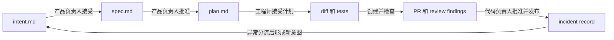

# AI 原生 SDLC 学习与落地笔记

> 原文　[The AI-Native SDLC playbook](https://claude.com/blog/the-ai-native-sdlc-playbook)
>
> 完整译文　[AiNativeSdlc-译文.md](AiNativeSdlc-译文.md)
>
> 本文只保留核心判断、产物循环、优先实践、采用顺序和待验证问题。原文细节与完整示例以译文为准。

## 1. AI 原生 SDLC 的核心变化

### 1.1 瓶颈已经移到代码之外

智能体显著缩短了代码实现时间，规划、评审、测试和发布仍然按照人类速度运行。安全团队、审批委员会和发布人员原本按照人类代码产量配置，无法直接承接智能体放大的产出。

这意味着优化目标需要从代码生成速度转向整个生命周期的流转速度。单独提高构建阶段的速度，只会让任务更快地堆积到相邻阶段。

### 1.2 线性流程变成持续循环

传统 SDLC 依靠文档、工单、会议和签字在角色之间交接。AI 原生 SDLC 把每个阶段的结果保存为下一个阶段可以直接读取的产物，并由已经接受的产物触发下一步。

生产环境中出现异常后，维护阶段会生成新的 `intent.md`，再进入规划、设计、构建、测试和部署。软件交付因此成为持续运行的循环。

### 1.3 Markdown 成为人与智能体的共同接口

早期阶段以 `intent.md`、`spec.md` 和 `plan.md` 为主要产物，人和智能体可以读取同一份上下文。产品负责人接受 `intent.md` 并批准 `spec.md`，工程师接受常规 `plan.md`，高风险计划交给技术负责人或架构师批准。进入构建阶段后，主要产物转为代码差异、测试结果、PR 记录和事故记录。

每份产物同时承担三项职责。

1. 保存上一阶段已经确认的决定。
2. 为下一阶段提供机器可执行的上下文。
3. 记录提出要求、生成结果和批准结果的主体。

### 1.4 治理从事后评审转向执行时约束

品牌、安全、合规和用户体验政策被写成 Skills，在规范或代码生成时应用。必须无条件成立的规则交给 Hooks、权限、沙箱、分支保护和确定性测试执行。

人工仍然负责需要判断的决定。人的注意力从逐行检查代码，转向检查意图、风险、异常项和生产发布授权。

### 1.5 智能体配置也属于需要测试的软件

`CLAUDE.md`、Skills、Hooks、提示词和模型都会改变智能体行为，因此需要持续评估。生产事故也要转成永久评估用例，避免配置变化再次引入同类问题。

## 2. 产物循环

循环可以简写为 `intent.md → spec.md → plan.md → diff → PR → incident → intent.md`。

| 产物 | 记录内容 | 人工关卡 | 触发的下一步 |
| --- | --- | --- | --- |
| `intent.md` | 问题、期望结果、受影响对象、约束和未决问题 | 产品负责人接受或关闭 | 生成需求与高层方案设计规范 |
| `spec.md` | 功能行为、用户流程、验收条件、高层集成边界、适用政策、未决问题和已标记风险 | 产品负责人批准，政策问题交给对应负责人，高风险事项咨询技术负责人 | 进入计划模式 |
| `plan.md` | 修改文件、实施顺序、风险和验证方法 | 工程师或技术负责人接受 | Claude 开始实现 |
| `diff` 与测试 | 实际代码变化及工具链给出的验证证据 | 工程师检查实现是否仍符合计划 | 创建 PR |
| PR 与评审发现 | 智能体评审、修复记录、严重程度和人工批准 | 代码负责人批准，生产发布另有授权 | 进入 CI/CD 和部署 |
| 事故记录 | 异常、证据、诊断、授权动作和复盘 | 服务负责人或值班人员分流 | 生成新的 `intent.md` 或评估用例 |

### 2.1 `spec.md` 的范围与审核

`spec.md` 规定系统需要交付的行为以及必须满足的约束。`compose-spec` Skill 负责固定必要章节、检查完整性并汇总适用的政策 Skills 输出。前端工作可以附上页面原型、用户流程和交互要求，后端或平台工作可以记录接口行为、数据约束和系统边界。文件、类、实施顺序和测试方案等实现细节由下一阶段的 `plan.md` 规定。

| 角色 | 审核责任 |
| --- | --- |
| 产品负责人 | 对照 `intent.md` 审核并最终批准 `spec.md` |
| 品牌、安全、合规和 UX 负责人 | 处理对应政策问题和相互冲突的规则 |
| 技术负责人 | 处理高风险事项、重大架构约束和技术可行性问题 |
| 工程师 | 依据批准的 `spec.md` 制定并审核 `plan.md` |

产品负责人批准 `spec.md` 后，工程师将 `intent.md` 和 `spec.md` 交给 Claude Code。Claude 在计划模式中读取代码库，与工程师确认文件范围、实施顺序、风险和测试，随后生成 `plan.md`。计划获得批准后才开始编写代码和测试。

产物链也是审计链。需要长期追踪的重点包括作者、时间戳、修订历史、使用的 Skills 版本、测试输出、评审结果和批准人。

## 3. 每个阶段优先采用的实践

| 阶段 | 优先实践 | 采用理由 |
| --- | --- | --- |
| 规划 | 使用 `intent.md` 一次记录原始意图 | 减少想法在需求会议和角色交接中的信息损失 |
| 规划 | 建立共享且受版本控制的意图目录 | 让产品负责人能够持续分流，并保留作者和修订历史 |
| 设计 | 在一次会话中完成需求与高层方案设计规范 | 同时确定功能行为、体验要求和系统约束，并保留可评审的 `spec.md` |
| 设计 | 用 Skills 应用品牌、安全、合规和 UX 政策 | 在规范形成时发现冲突，避免到后期评审才返工 |
| 构建 | 默认从计划模式开始 | 代码生成前先评审文件范围、实施顺序、风险和验证方法 |
| 构建 | 用 `CLAUDE.md` 保存代码库工作知识 | 让所有会话共享命令、约定、架构和常见错误 |
| 测试 | 为每个会话提供本地反馈循环 | Claude 在人工接手前自行运行构建、测试和视觉检查 |
| 测试 | 对智能体配置运行持续评估 | 模型、提示词、Skills 或 Hooks 变化后仍能维持相同标准 |
| 部署 | 让 Claude 加入 PR 评审与修复循环 | 所有 PR 接受一致的评审轮次，人工集中判断意图和风险 |
| 部署 | 用 Hooks、分支保护和沙箱设置行动边界 | 智能体可以完成生产关卡前的工作，但不能自行越过关卡 |
| 维护 | 用确定性控制带触发诊断和处置 | 模型不负责检测异常，只在明确越界后按权限等级行动 |
| 维护 | 把事故与安全发现重新送入产物循环 | 小问题进入 PR，大问题形成 `intent.md`，修复后增加评估用例 |

### 3.1 暂不优先采用自动模式

自动模式依赖已经成熟的 `CLAUDE.md`、Skills、Hooks、权限配置和测试套件。团队还无法稳定验证智能体工作时，扩大自主程度只会增加评审压力和返工量。

## 4. 落地顺序与依赖关系

原文的采用顺序与六个阶段的业务顺序不同。可以从没有前置依赖的基础项开始，再逐步增加治理和自主运行能力。

### 4.1 第一批基础项

以下项目可以并行启动。

1. 建立 `intent.md` 模板和意图存放位置。
2. 在代码库根目录维护一页以内的 `CLAUDE.md`。
3. 把构建、测试和 lint 封装成单一命令，建立反馈循环。
4. 为受保护路径、凭据和格式检查设置快速 Hooks。
5. 将计划模式设为工程工作的默认起点。

### 4.2 第二批团队能力

1. 将执行不一致的组织政策写成 Skills。
2. 将验证、研究等重复工作写成子智能体。
3. 从近期任务中建立第一组持续评估用例。
4. 用 `compose-spec` 读取已经接受的 `intent.md`，汇总适用的政策 Skills 输出并生成 `spec.md`。

### 4.3 第三批治理能力

1. 使用统一的 `REVIEW.md` 建立智能体 PR 评审。
2. 启用分支保护和代码负责人批准。
3. 把生产授权、受保护路径和变更工单实现为审批 Hooks。
4. 通过托管设置统一沙箱、网络、凭据和 MCP Server 权限。

### 4.4 第四批自动化能力

1. 在 CI/CD 中先加入只读判断任务，例如分析失败构建和总结偶发测试。
2. 再加入通过 PR 提交的写入任务，例如修复 lint 和处理评审意见。
3. 按开发、预发布和生产环境划分自主等级。
4. 把回滚封装成单一命令，并在预发布环境定期演练。

### 4.5 第五批持续运行能力

1. 用确定性脚本监控拥有稳定基线的指标。
2. 根据 1σ、2σ 和 3σ 等控制带配置不同权限。
3. 将诊断结果写成 `intent.md`，交给服务负责人分流。
4. 定期扫描代码库，并把修复与评估重新送入循环。

### 4.6 主要依赖关系

| 能力 | 依赖项 |
| --- | --- |
| 需求与高层方案设计生成 | 已接受的 `intent.md`、`compose-spec`，以及适用的品牌、安全、合规、UX 和 API Skills |
| Skills | 有明确负责人的政策，以及书面唯一事实来源 |
| 子智能体 | `CLAUDE.md`，最好已经具备反馈循环 |
| 持续评估 | `CLAUDE.md`、反馈循环和真实任务样本 |
| PR 智能体评审 | `CLAUDE.md`、相关 Skills、评审政策和分支保护 |
| CI/CD 自主任务 | PR 评审、审批 Hooks、沙箱、短期凭据和可靠回滚 |
| 维护循环 | `intent.md` 格式、PR 关卡、Hooks、回滚路径和确定性监控 |

## 5. 落地检查清单

### 5.1 产物与责任

- [ ] 每种产物都指定唯一事实来源。
- [ ] `intent.md`、`spec.md` 和 `plan.md` 均进入版本控制。
- [ ] `compose-spec` 固定 `spec.md` 的必要章节，并支持生成与完整性校验。
- [ ] 产品负责人审核 `spec.md`，对应政策负责人处理已标记的政策问题。
- [ ] 常规 `plan.md` 由工程师批准，高风险计划由技术负责人或架构师批准。
- [ ] 业务系统记录与 Markdown 产物之间保留记录 ID 或 commit SHA。
- [ ] 实现偏离计划时，同一次提交会更新 `plan.md`。

### 5.2 代码库上下文

- [ ] 根目录存在团队共享的 `CLAUDE.md`。
- [ ] 文件包含构建、测试和 lint 命令及健康输出示例。
- [ ] 文件记录关键约定、架构边界和 Claude 重复犯过的错误。
- [ ] 内容控制在一页以内，过期信息会及时删除。
- [ ] `CLAUDE.md` 的变更由代码负责人评审。

### 5.3 验证与评估

- [ ] 构建和测试可以使用单一命令在本地运行。
- [ ] 失败命令返回非零退出码。
- [ ] 缺陷修复先提交能够复现问题的失败测试。
- [ ] 修复期间，Hook 或 PR 检查会阻止智能体削弱测试。
- [ ] 界面工作可以生成截图并与设计原型比较。
- [ ] 评估集包含 20 到 50 个近期真实任务及其可接受结果。
- [ ] 每次生产事故都会转成永久评估用例。

### 5.4 治理与安全

- [ ] 建议性政策写成 Skills，强制性政策由 Hooks 或确定性检查执行。
- [ ] 智能体无法直接推送主分支，也无法批准自己的 PR。
- [ ] 生产发布需要指定人员授权。
- [ ] 非交互任务使用独立身份、短期令牌和范围化权限。
- [ ] 沙箱限制文件、网络和凭据访问，失败后不能绕到沙箱外执行。
- [ ] MCP Server 与插件来源由组织允许列表控制。

### 5.5 运行与度量

- [ ] 回滚路径已经在预发布环境定期演练。
- [ ] 监控脚本保持确定性，模型不负责判断是否越过控制带。
- [ ] 调用、发现、修复、忽略和批准决定都有时间戳。
- [ ] 同时跟踪交付速度、返工率、变更失败率和事故重复率。
- [ ] 增加并行会话前，确认人工评审能力仍能跟上产出。

## 6. Skills Hub

六步流程中的 Skills、输出、阶段产物和职责边界已移至 [AiNativeSdlc-skills-hub.md](AiNativeSdlc-skills-hub.md)。该 Hub 同时记录各阶段是否需要新增 Skill，以及哪些工作应交给斜杠命令、`CLAUDE.md`、`REVIEW.md`、Hook、CI 或操作手册。

## 7. 当前理解

### 7.1 SDLC 的改造对象是交接成本

阶段之间的交接方式、触发条件和人工关卡直接影响周期时间。让 Claude 参与每个阶段，是实现这些改变的手段。

### 7.2 产物比会话更重要

会话结束后，只有提交到版本控制的产物可以继续被下一个阶段读取和审计。提示词、Skill 版本、批准记录和测试输出都应跟随产物保存。仅依赖聊天记录无法支撑长期流程。

### 7.3 自主程度取决于验证与权限

模型能力只是其中一个条件。测试能否在本地运行、权限能否限制、PR 是否需要人工批准，以及回滚是否经过演练，决定了智能体可以安全地运行多长时间。

### 7.4 人的工作会向判断与系统设计移动

工程师需要花更多时间编写计划、建设反馈循环、维护 Skills 和 Hooks，并评审多个并行会话的结果。产品负责人和政策负责人则需要处理智能体标记的冲突和高风险事项。

### 7.5 维护阶段决定循环能否成立

如果事故、扫描发现和复盘结果没有重新进入 `intent.md` 与评估集，前五个阶段仍然只是更快的线性流程。维护阶段负责把生产证据重新送回规划与测试。

## 8. 待验证的问题

1. Jira、Figma 和代码库同时保存记录时，哪个系统是每类产物的唯一事实来源，冲突由谁处理？
2. `intent.md`、`spec.md` 和 `plan.md` 需要采用怎样的目录与命名规范，才能长期关联同一项变更？
3. 哪些变更可以由普通工程师批准，哪些变更必须交给技术、产品或政策负责人？
4. Skills 数量增加后，如何处理触发冲突、版本组合和过期政策？
5. 20 到 50 个评估任务能否覆盖真实工作，评估通过率下降多少才应阻止合并？
6. 自动评审产生的 Nit 和安全扫描误报会不会形成新的分流队列？谁负责控制噪声？
7. 并行会话增加产出后，人工评审能力会在哪个数量级首先成为瓶颈？
8. 无界面智能体使用什么身份运行，怎样保证短期凭据、操作归属和审计记录能够对应？
9. 除 DORA 指标外，还需要怎样结合返工率、需求修改次数和重复事故，判断周期缩短没有牺牲质量？
